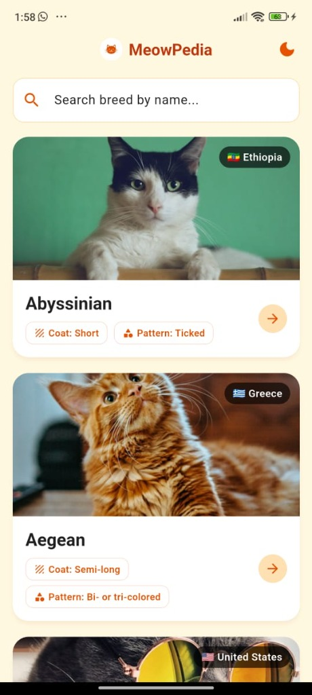
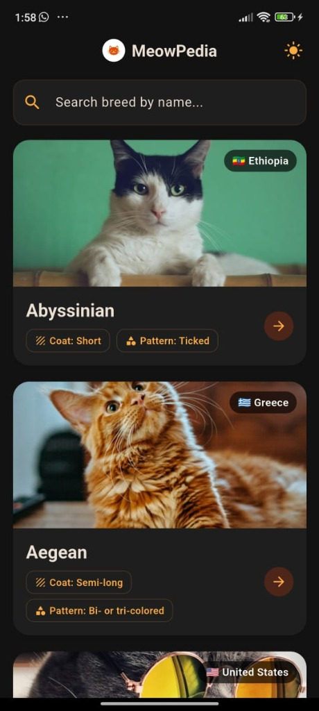
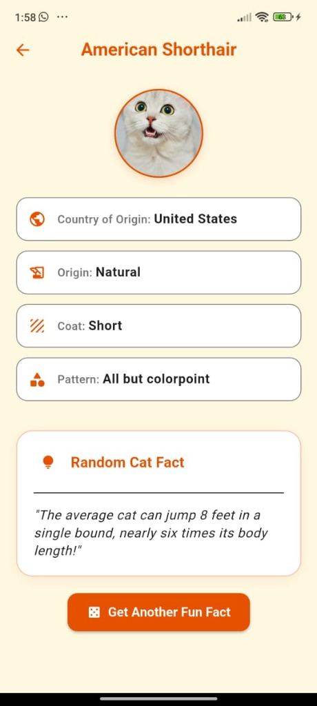
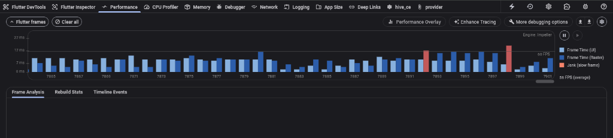

# 🐱 MiauPedia — Cat Breed Directory App

[](https://flutter.dev)
[](https://flutter.dev)
[](LICENSE)

**MiauPedia** es una aplicación móvil moderna desarrollada en Flutter para la prueba técnica de **Nextep Innovation**. Consume la API pública de [CatFact Ninja](https://catfact.ninja) para ofrecer un directorio interactivo de razas de gatos con arquitectura offline-first, paginación fluida, soporte bilingüe (Español/Inglés), modo oscuro y animaciones cuidadas.

---

## 📸 Capturas de Pantalla

| MiauPedia Home (Light) | Modo Oscuro (Dark) | Detalle de Raza |
|:---:|:---:|:---:|
|  |  |  |

---

## 🏛️ Arquitectura del Proyecto

El proyecto sigue los principios de **Clean Architecture por Features** (Módulos funcionales), garantizando desacoplamiento, mantenibilidad y facilidad de prueba.

```text
lib/
├── app/                      # Configuración global
│   ├── theme/                # Paleta Warm Amber, tipografía y ThemeData (Light & Dark)
│   ├── app.dart              # MaterialApp.router respondiendo a ThemeService
│   └── router.dart           # Rutas parametrizadas con GoRouter (/breed/:name)
├── core/                     # Capa transversal reusable
│   ├── cache/                # CacheManager Hive (Stale-While-Revalidate, TTL 30m)
│   ├── di/                   # Inyección de dependencias con GetIt (injection.dart)
│   ├── lifecycle/            # AppLifecycleObserver (>5 min background revalidation)
│   ├── localization/         # LocalizationService (Conmutador 🇪🇸 ES / 🇺🇸 EN)
│   ├── network/              # ApiClient Dio (retries exponenciales 1s/2s/4s)
│   ├── theme/                # ThemeService para conmutación manual de modo oscuro
│   └── widgets/              # Widgets compartidos (CatImageHelper, ConnectivityBanner, ErrorView)
└── features/                 # Módulos funcionales desacoplados
    ├── breed_detail/         # Módulo de Detalle + Dato Curioso Aleatorio (Cubit)
    ├── breeds/               # Módulo de Lista + Paginación + Búsqueda (BLoC)
    └── splash/               # Módulo de Pantalla de Inicio Animada
```

---

## 💡 Decisiones Técnicas

- **Gestión de Estado (BLoC & Cubit)**: Se utiliza `flutter_bloc` para separar la lógica de presentación. `BreedsBloc` maneja paginación con transformaciones `droppable` (evita duplicados de red) y filtrado local con `debounce(300ms)`. `BreedDetailCubit` gestiona de forma aislada la carga del dato curioso aleatorio.
- **Persistencia en Caché (Hive CE)**: Se eligió `hive_ce` por su velocidad de lectura/escritura en disco. Sigue la estrategia **Stale-While-Revalidate**:
  - `< 30 min`: Sirve caché directamente.
  - `30 min a 2 h`: Sirve caché inmediatamente y revalida en background sin bloquear la interfaz.
  - `> 2 h`: Fuerza la descarga de red.
- **Inmutabilidad (Freezed)**: `freezed` y `json_serializable` garantizan modelos de datos fuertemente tipados e inmutables.
- **Fotos de Gatos (Unsplash + CachedNetworkImage)**: Integra imágenes reales en alta resolución con caché en disco y fallback automático a la bandera del país de origen en caso de fallo o modo sin conexión.

---

## 🧪 Pruebas Unitarias (Principios F.I.R.S.T.)

Las pruebas de esta aplicación siguen los 5 pilares **F.I.R.S.T.**:
- **Fast**: Ejecución en milisegundos simulando la red y base de datos con `mocktail`.
- **Isolated**: Cada test es independiente y determinista.
- **Repeatable**: Resultados consistentes en cualquier entorno.
- **Self-validating**: Resultado binario pass/fail claro.
- **Timely**: Cobertura de BLoCs, Cubits, Mappers y Repositorios.

### 🚀 Cómo ejecutar la suite de pruebas:

```bash
# Ejecutar todas las pruebas unitarias (16/16 pasando)
flutter test
```

---

## ⚡ Auditoría de Performance & Evidencia

### 📈 Traza de Rendimiento en Flutter DevTools (Impeller Engine)
- **Tasa de Refresco (60 FPS promedio)**: La traza de rendimiento obtenida en DevTools (*Performance Profile*) evidencia un renderizado continuo y fluido del `ListView.builder` manteniendo el tiempo de UI y Rasterization por debajo de los **16.6 ms (60 FPS)** durante el scroll infinito.
- **Sin Jank Significativo**: La reutilización de celdas y el caché en disco con `CachedNetworkImage` garantizan que no haya caídas sostenidas ni degradación de memoria.



```text
Flutter DevTools Performance Summary:
Engine: Impeller
Average Frame Rate: ~56 - 60 FPS
UI / Raster Frame Time: < 8 - 14 ms
```

### 📦 Optimización de Tamaño de APK (`flutter build apk --analyze-size`)
Ejecución de compilación optimizada para arquitectura `android-arm64`:
- **Tree-Shaking de Fuentes (Icons)**:
  - `CupertinoIcons.ttf`: Reducido de 257,628 a 848 bytes (**99.7% de reducción**).
  - `MaterialIcons-Regular.otf`: Reducido de 1,645,184 a 4,428 bytes (**99.7% de reducción**).
- **Tamaño APK Release Final**: **17.7 MB (18 MB total comprimido)**.

```text
app-release.apk (total compressed)                                         18 MB
━━━━━━━━━━━━━━━━━━━━━━━━━━━━━━━━━━━━━━━━━━━━━━━━━━━━━━━━━━━━━━━━━━━━━━━━━━━━━━━━
  assets/
    flutter_assets                                                        235 KB
  classes.dex                                                             244 KB
  lib/
    arm64-v8a                                                              17 MB
    Dart AOT symbols accounted decompressed size                            6 MB
      package:flutter                                                       3 MB
      dart:core                                                           291 KB
      package:hive_ce                                                      97 KB
      package:cat_directory_app                                            82 KB
      package:material_color_utilities                                     70 KB
      package:go_router                                                    59 KB
      package:dio                                                          51 KB
      package:flutter_cache_manager                                        32 KB
```

---

## 🔧 Instalación y Ejecución

```bash
# 1. Clonar el repositorio
git clone git@github-personal:jorgeDevEngineer/cat_directory_app.git
cd cat-app

# 2. Obtener dependencias
flutter pub get

# 3. Ejecutar en dispositivo/emulador
flutter run
```
